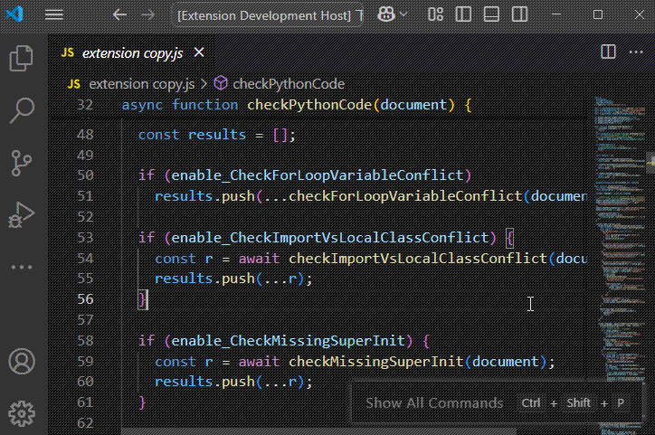
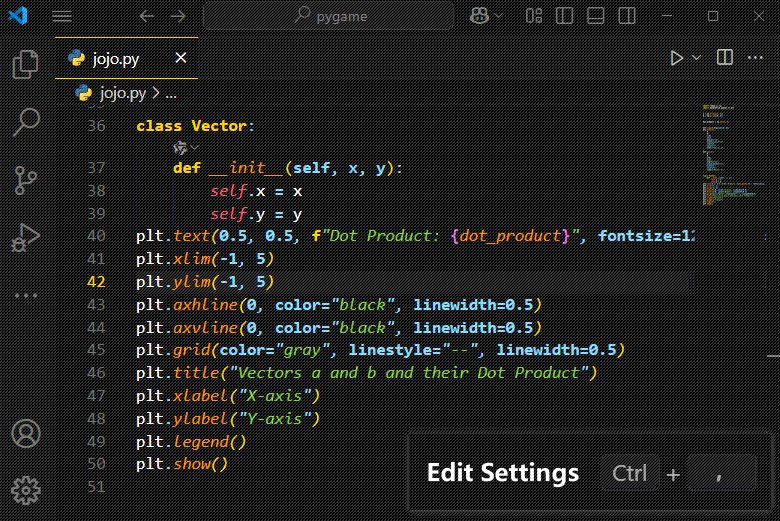

# 🎭 PyCodeJoJo VSCode Extension

PyCodeJoJo 是一个功能丰富的 VSCode 扩展，提供了多个变形金刚和超级英雄主题，以及一些实用的编码辅助功能。

PyCodeJoJo is a feature-rich VSCode extension that offers multiple Transformers and Superhero themes, along with several useful coding utilities.

## ⭐ 特性 | Features

### 🎭 切换主题 | Switch Theme

1. ⌨️ `Ctrl+Shift+P` 打开命令面板 | Open command palette
2. 🔍 输入 "Chose Theme" | Type "Chose Theme"
3. ✨ 选择任意 PyCodeJoJo 主题 | Select any PyCodeJoJo theme

### 🎨 可用主题 | Theme Collection

- 🤖 **Iron Man Mark 3** - 钢铁侠经典配色
- 🐝 **Bumblebee** - 大黄蜂明亮配色
- 🦇 **Dark Knight** - 黑暗骑士深色主题
- ❄️ **Frozen Crystal** - 冰霜水晶主题
- 🚛 **Optimus Prime** - 擎天柱经典配色
- 💎 **Purple Crystal/Phantom** - 紫色水晶/幻影系列主题
- 🌳 **Emerald Forest** - 翡翠森林主题

### 🛠️ 功能特性 | Features

### 使用示例 | Usage Examples

#### 🎯 颜色选择器 | Color Picker

- 📚 全面的语言支持 | Comprehensive language support
  - Python, JavaScript, TypeScript, Java, C++, C#, Go, Rust, HTML, CSS, SCSS, LESS, Vue, Svelte,JSON, YAML, XML,Markdown, Plain text
- 🔍 快速选择和预览颜色 | Quick color selection and preview
- 🔄 支持多种颜色格式 | Support for multiple color formats
  - HEX formats: #fff, #ffffff, #ffffffff (with alpha)
  - RGB formats: rgb(R,G,B), rgba(R,G,B,A)
  - Tuple formats: (R,G,B), (R,G,B,A)
- 🎯 完善的 alpha 通道支持和智能格式保持 | Complete alpha channel support with intelligent format preservation
  - Supports alpha values in both 0-1 and 0-255 range
  - Precisely maintains original format and precision
- 👀 实时颜色预览 | Real-time color preview

你可以通过 VSCode 设置自定义启用的功能：
You can customize which features are enabled through VSCode settings:

1. 按下 `Ctrl+,`（Mac 上为 `Cmd+,`） | Press `Ctrl+,` (or `Cmd+,` on Mac)
2. 搜索 ">pycodejojo" | Search for ">pycodejojo"
3. 根据需要开启或关闭特定功能 | Toggle specific features as needed

## 📖 功能的启用与关闭 | Enable and Disable Features

1. ⌨️ 按下 `Ctrl + ,` 打开设置面板 | Press `Ctrl + ,` to open Settings
2. 🔍 搜索 `>pycodejojo` 过滤配置项 | Search `>pycodejojo` to filter configurations

## ⚠️ 已知问题 | Known Issues

当同时使用 PyCodeJoJo 和 Pylance 插件时，Python 文件中的颜色字符串可能会在左侧出现两个取色器色块，导致界面混乱。如果你希望避免这种混乱局面，可以通过以下步骤关闭 Pylance 的取色器功能：

1. 按下 `Ctrl + ,` 打开设置
2. 在搜索框中输入 `python.analysis.enableColorPicker`
3. 取消勾选该选项即可关闭 Pylance 的取色器

When using PyCodeJoJo alongside Pylance, you may notice two color pickers appearing on the left side of color strings in Python files, causing visual clutter. To avoid this confusion, you can disable Pylance's color picker by:

1. Press `Ctrl + ,` to open settings
2. Search for `python.analysis.enableColorPicker`
3. Uncheck this option to disable Pylance's color picker

## 🤝 贡献 | Contribution

欢迎提交问题和功能建议到 GitHub 仓库
Welcome to submit issues and feature suggestions to GitHub repository:
[GitHub Repository](https://github.com/yourusername/pycodejojo)
