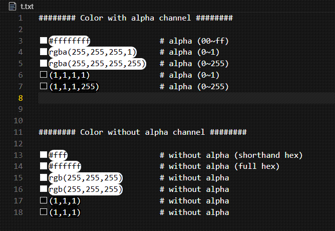

# 🎭 PyCodeJoJo VSCode Extension

PyCodeJoJo 是一个功能丰富的 VSCode 扩展，提供了多个变形金刚和超级英雄主题，以及一些实用的编码辅助功能。

PyCodeJoJo is a feature-rich VSCode extension that offers multiple Transformers and Superhero themes, along with several useful coding utilities.

## 🎬 操作示例 | Operation Examples

## ⚠️ 已知问题 | Known Issues

当同时使用 PyCodeJoJo 和 Pylance 时，Python 文件中的颜色字符串会在其左侧出现两个取色器色块。这是因为 Pylance 有自己的取色器实现，但仅支持 .py 文件中的 "#ffffff" 和 "#ffffffff" 两种格式。如果你想只保留一个取色器，可以通过以下步骤关闭 Pylance 的取色器功能：

1. 按下 `Ctrl + ,` 打开设置
2. 在搜索框中输入 `python.analysis.enableColorPicker`
3. 取消勾选该选项即可关闭 Pylance 的取色器

When using PyCodeJoJo alongside Pylance, you may notice two color pickers appearing on the left side of color strings in Python files. This is because Pylance has its own color picker implementation that only supports "#ffffff" and "#ffffffff" formats in .py files. If you want to keep only one color picker, you can disable Pylance's color picker by:

1. Press `Ctrl + ,` to open settings
2. Search for `python.analysis.enableColorPicker`
3. Uncheck this option to disable Pylance's color picker

PyCodeJoJo 提供更全面的取色器支持：
PyCodeJoJo offers more comprehensive color picking support with:

- Support for all file types (not just .py files)
- Support for multiple color formats with accurate alpha channel handling:
  - #fff (hex shorthand)
  - #ffffff (hex)
  - #ffffffff (hex with alpha channel)
  - rgb(R, G, B)
  - rgba(R, G, B, A) (支持 0-1 和 0-255 范围的 alpha 值 | supports alpha values in both 0-1 and 0-255 range)
  - (R, G, B)
  - (R, G, B, A) (支持 0-1 和 0-255 范围的 alpha 值 | supports alpha values in both 0-1 and 0-255 range)

你可以通过 VSCode 设置自定义启用的功能：
You can customize which features are enabled through VSCode settings:

1. 按下 `Ctrl+,`（Mac 上为 `Cmd+,`） | Press `Ctrl+,` (or `Cmd+,` on Mac)
2. 搜索 ">pycodejojo" | Search for ">pycodejojo"
3. 根据需要开启或关闭特定功能 | Toggle specific features as needed

## ⭐ 特性 | Features

### 🎨 主题集合 | Theme Collection

- 🤖 **Iron Man Mark 3** - 钢铁侠经典配色 | Iron Man classic color scheme
- 🐝 **Bumblebee** - 大黄蜂明亮配色 | Bumblebee bright color scheme
- 🦇 **Dark Knight** - 黑暗骑士深色主题 | Dark Knight dark theme
- ❄️ **Frozen Crystal** - 冰霜水晶主题 | Frozen Crystal theme
- 🚛 **Optimus Prime** - 擎天柱经典配色 | Optimus Prime classic color scheme
- 💎 **Purple Crystal/Phantom** - 紫色水晶/幻影系列主题 | Purple Crystal/Phantom series themes
- 🌳 **Emerald Forest** - 翡翠森林主题 | Emerald Forest theme

### 🛠️ 功能特性 | Features

#### 🎯 颜色选择器 | Color Picker

- 🔍 快速选择和预览颜色 | Quick color selection and preview
- 🔄 支持多种颜色格式(HEX, RGB, HSL) | Support multiple color formats (HEX, RGB, HSL)
- 🎯 智能保持原始颜色格式（包括 alpha 值格式） | Intelligently maintains original color format (including alpha format)
  - 保持元组格式 (R,G,B) 和 (R,G,B,A) | Preserves tuple format (R,G,B) and (R,G,B,A)
  - 保持整数/浮点 alpha 值格式 | Maintains integer/float alpha value format
  - 保持 rgb/rgba 前缀 | Preserves rgb/rgba prefix
- 👀 实时颜色预览 | Real-time color preview

#### ✨ 设置字体背景色 | Set Font Background Color

1. ⚡ 通过命令面板或快捷键激活功能 | Activate via command palette or shortcut
2. 📝 选择需要设置背景色的代码 | Select code for background color
3. 🎨 从调色板中选择合适的背景色 | Choose suitable background color from palette

## 📥 安装 | Installation

1. 🚀 打开 VS Code | Open VS Code
2. ⌨️ 按下 `Ctrl+Shift+X` 打开扩展栏 | Press `Ctrl+Shift+X` to open Extensions
3. 🔍 搜索 `pycodejojo` | Search for `pycodejojo`
4. ✅ 点击安装 | Click Install

## 📖 使用方法 | Usage

### 🔧 设置参数 | Configure Settings

1. ⌨️ 按下 `Ctrl + ,` 打开设置面板 | Press `Ctrl + ,` to open Settings
2. 🔍 搜索 `>pycodejojo` 过滤配置项 | Search `>pycodejojo` to filter configurations
3. 🛠️ 调整主题参数等 | Adjust many parameters

### 🎭 切换主题 | Switch Theme

1. ⌨️ `Ctrl+Shift+P` 打开命令面板 | Open command palette
2. 🔍 输入 "Chose Theme" | Type "Chose Theme"
3. ✨ 选择任意 PyCodeJoJo 主题 | Select any PyCodeJoJo theme

## 🤝 贡献 | Contribution

欢迎提交问题和功能建议到 GitHub 仓库
Welcome to submit issues and feature suggestions to GitHub repository:
[GitHub Repository](https://github.com/yourusername/pycodejojo)

## 📝 更新日志 | Changelog

详见 | See [CHANGELOG.md](CHANGELOG.md)
